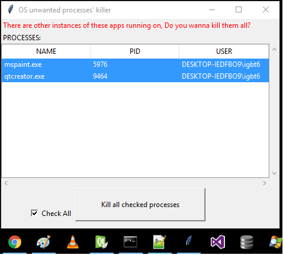

## Os Processes' Killer
Useful Tool when you want to kill chosen system processes 


### Requirements:
* Python 3.x 
* psutil
  
  ```
  pip install psutil
  ```

* If you need an executable file:

  Install pyinstaller (more: http://www.pyinstaller.org/)
  ```
  pip install pyinstaller
  ```

  Create executable file:
  ```
  pyinstaller --noconsole --onefile OsProcessKiller.py
  ```

### Usage:
* Example usage scenario:
There are many accounts configured on the computer, and users often switch between accounts without logging off.
The users use same aplications that might work incorrectly when more than one instance is being run on.
A User sets up the Task Scheduler/Crone etc. to fire ```OsProcessKiller``` app up while switching between accounts.
Application lists all instances of already running apps configured in ```UnwantedProcesses.txt``` allowing the user to kill their processes accordingly.

<p View of the application align="center">
  
</p>

In case of any questions feel free to ask! 

